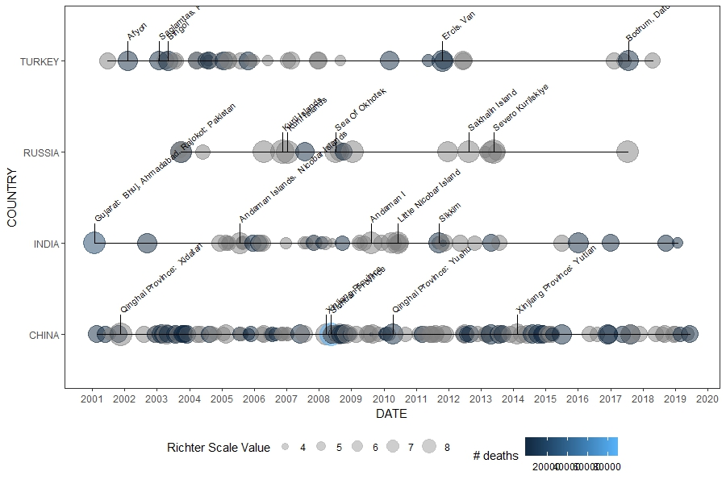
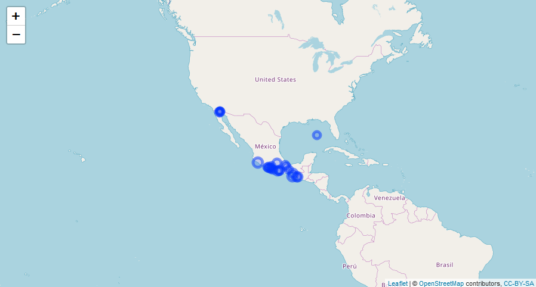

## Status

## Introduction
The U.S. National Oceanographic and Atmospheric Administration (NOAA) maintains a dataset on significant earthquakes around the world. 
The quakeR package includes functions to clean the data in preparation for plotting as well as the plotting functions themselves.

### Custom ggplot2 layers

### Leaflet map (note this is an image of the interactive map)

For more info check out the package vignette
